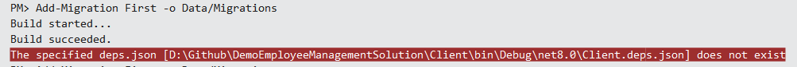
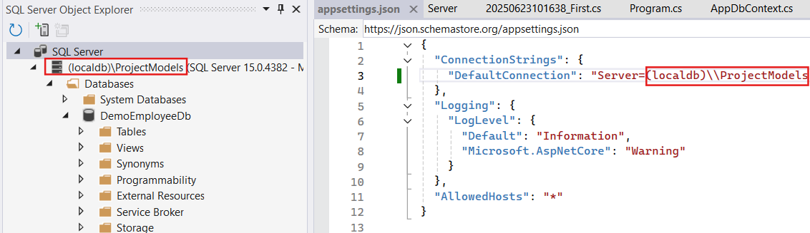
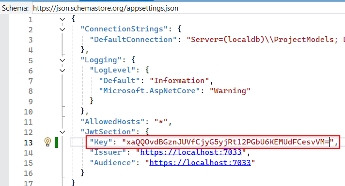

# Employee Management System

## System Design


## Features

1. Admin/Manager/User Login
2. Identity protected with JWT token with refresh token supported.
3. CRUD on Employees data.
4. Report Generation.
5. Print out
6. User/Manager Management ONLY by the Administrator.

## Tech Stack

Server: ASP .NET Core Web API

Client: Blazor WebAssembly Standalone APP

## Data Migration

Tools -> NuGet Package Manager -> Package Manager Console

DefaultProject: ServerLibrary

```bash
Add-Migration First -o Data/Migrations
Add-Migration -o Data/Migrations

Name: First

Update-Database
```



I got this error when running the command, you can reload the Client project to avoid this error.



The server name of the connection string needs to match your SQL Server's instance name.

DefaultProject: ServerLibrary

```bash
Add-Migration AddRoles

Update-Database
```

```bash
Add-Migration TokenInfo

Update-Database
```

## Generate Jwt key



1. `openssl rand -base64 32`

Or 

2. Create a new Console APP

```sh
dotnet new console -n JwtKeyGenerator
cd JwtKeyGenerator
```

Program.cs

```cs
using System;
using System.Security.Cryptography;

class Program
{
    static void Main()
    {
        var key = new byte[32]; // 256-bit key
        using (var rng = RandomNumberGenerator.Create())
        {
            rng.GetBytes(key);
        }
        string base64Key = Convert.ToBase64String(key);
        Console.WriteLine("Generated JWT Key:");
        Console.WriteLine(base64Key);
    }
}
```

`dotnet run`

